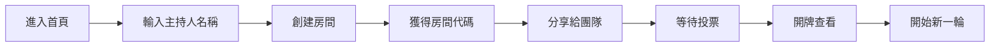
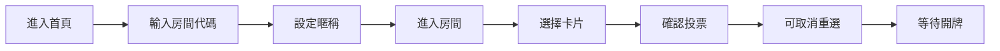
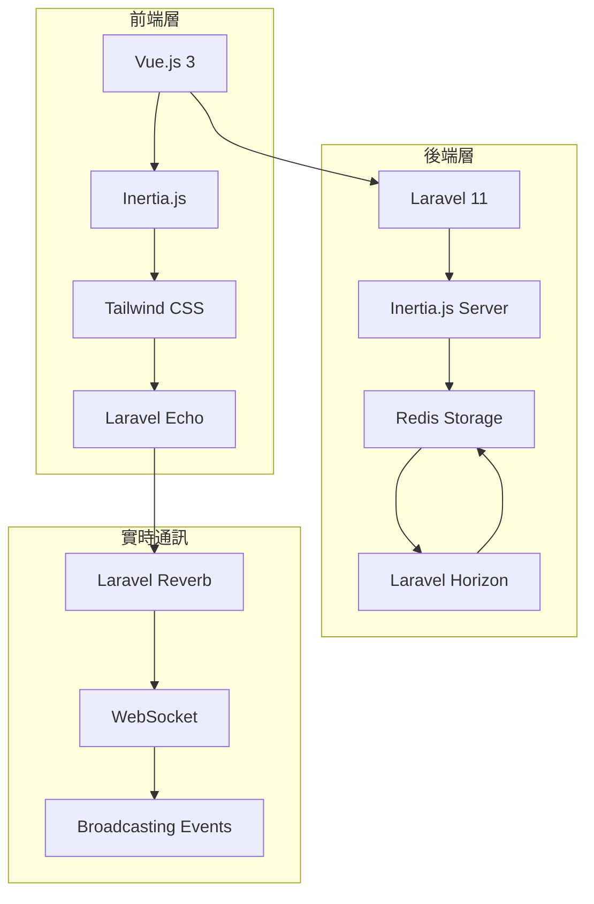

# Planning Poker

<div align="center">
  
  
  
  
</div>

<div align="center">
  <h3>現代化敏捷開發估點工具</h3>
  <p>支援實時協作、多人同步的 Planning Poker 應用程式</p>
</div>

---

## 特色功能

### **互動體驗**
- **直觀卡片選擇** - Fibonacci 數列 + 特殊卡片
- **投票取消重選** - 支援隨時更改決定
- **響應式設計** - 完美適配各種螢幕
- **現代暗色主題** - 護眼且專業的介面

### **實時同步**
- **WebSocket 廣播** - 零延遲狀態同步
- **多人協作** - 無限參與者支援
- **即時統計** - 動態顯示投票進度
- **房間管理** - 安全的房間代碼系統
---

## 可用卡片

**標準 Fibonacci 點數**  
`0` `1` `2` `3` `5` `8` `13` `21`

**特殊卡片**  
- `Coffee` - 咖啡休息時間
- `?` - 不確定或需要更多資訊  
- `Infinity` - 任務過於龐大

---

## 快速開始

### 系統需求

- **PHP** >= 8.2
- **Node.js** >= 22.x
- **Redis** >= 6.x
- **Composer** 最新版

### 安裝步驟

```bash
# Step 1: 克隆專案
git clone https://github.com/your-username/planning-poker.git
cd planning-poker

# Step 2: 安裝依賴
composer install
npm install

# Step 3: 環境設定
cp .env.example .env
php artisan key:generate

# Step 4: 設定 Redis 連線
# 編輯 .env 檔案
REDIS_HOST=127.0.0.1
REDIS_PASSWORD=null
REDIS_PORT=6379

# Step 5: 設定廣播服務
BROADCAST_CONNECTION=reverb
QUEUE_CONNECTION=redis

# Step 6: 編譯前端資源
npm run build
# 開發模式: npm run dev

# Step 7: 啟動服務
php artisan serve
php artisan horizon  # 佇列處理
php artisan reverb:start  # WebSocket 伺服器
```

---

## 使用方式

### **主持人流程**

<div align="center">



</div>

### **參與者流程**

<div align="center">



</div>

---

## 技術架構

<div align="center">



</div>

### **核心技術**

**後端框架**
- **Laravel 12.x** - 現代 PHP 框架，提供強大的後端支援
- **Laravel Reverb** - 官方 WebSocket 伺服器解決方案
- **Laravel Horizon** - Redis 佇列監控和管理

**前端技術**  
- **Vue.js 3.x** - 漸進式前端框架
- **Inertia.js** - 現代全端開發橋接工具
- **Tailwind CSS 3.x** - 實用優先的 CSS 框架

**基礎設施**
- **Redis 6.x** - 高效能快取與佇列系統
- **WebSocket** - 實時雙向通訊協定

---

## 功能展示

### **主要頁面**

#### **首頁**
三種進入方式讓使用者彈性選擇
- 加入房間 - 參與者快速進入
- 創建房間 - 主持人建立新會議  
- 重新主持 - 斷線後快速恢復

#### **投票頁面**
直觀的卡片選擇介面
- 實時狀態更新 - 即時同步投票進度
- 投票進度顯示 - 清楚掌握參與狀況
- 取消重選功能 - 支援隨時修改決定

#### **主持人面板**
全面的房間控制中心
- 參與者管理 - 監控所有成員狀態
- 投票統計 - 完整的進度追蹤
- 開牌控制 - 決定結果揭曉時機

#### **結果展示**
清晰的結果呈現介面
- 個人投票顯示 - 透明的決策過程
- 統計資訊 - 詳細的投票分析
- 重置功能 - 快速開始下一輪

### **實時功能**

- **即時通知** - 參與者加入/離開通知
- **動態更新** - 投票狀態即時同步
- **人員管理** - 參與者列表實時更新
- **狀態同步** - 開牌/重置狀態廣播

---

## 開發相關

### **主要指令**

```bash
# 開發環境
npm run dev          # 前端熱重載
php artisan serve    # 啟動開發伺服器

# 背景服務
php artisan horizon         # 佇列處理器
php artisan reverb:start    # WebSocket 伺服器

# 維護指令
php artisan queue:clear     # 清空佇列
php artisan cache:clear     # 清除快取
redis-cli flushall          # 清空 Redis
```

### **專案結構**

```
planning-poker/
├── resources/js/Pages/PlanningPoker/  # Vue 頁面元件
├── app/Http/Controllers/              # Laravel 控制器
├── app/Events/                        # WebSocket 事件
├── resources/js/Components/           # 共用元件
└── routes/web.php                     # 路由定義
```

---

## 授權條款

本專案採用 [MIT License](LICENSE) 授權。

**開發人員**: Yu Lin Chou  
**技術支援**: 歡迎提交 Issue 或 Pull Request